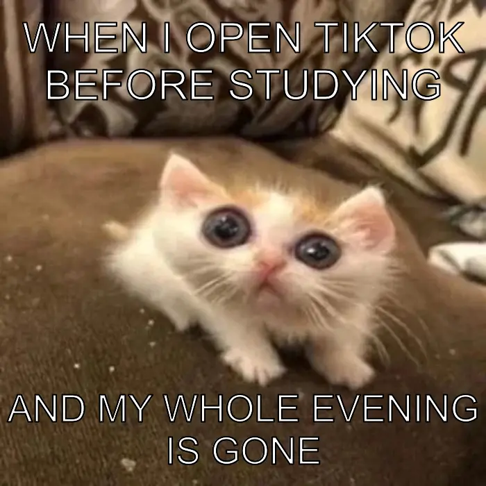

# Project 1 – Meme

## Overview

This project was completed for **STATS 220** at the University of Auckland.

The aim of this project was to create an original meme using R and the **magick** package. I designed a meme based on the common student experience of opening TikTok before studying and unexpectedly spending the whole evening on it.

## Skills

- R
- magick
- Image manipulation
- R Markdown

## Files

- `meme.R` – R code used to create the meme
- `project1_report.Rmd` – Source report
- `project1_report.html` – Final report
- `my_meme.png` – Final meme
- `my_animated_meme.gif` – Animated version

## Final Meme

