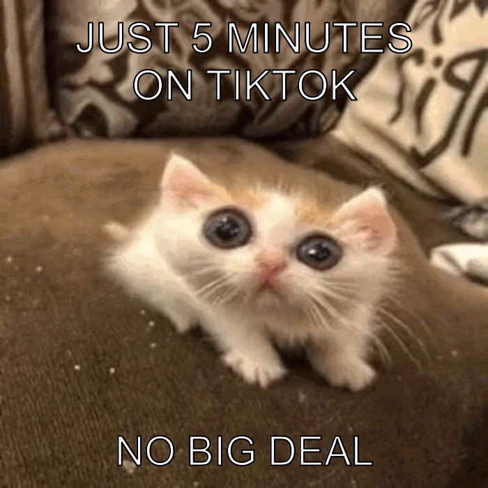

```{r setup, include=FALSE}
knitr::opts_chunk$set(echo=TRUE, message=FALSE, warning=FALSE, error=FALSE)
```

```{css}
@import url('https://fonts.googleapis.com/css2?family=Comic+Neue:wght@400;700&display=swap');

body {
  font-family: 'Comic Neue', cursive;
  color: #3B181B;
  background-color: #FFEBED;
  line-height: 1.5;
  padding: 20px;
}
h1, h2 {
  color: #84585C;
}
img {
  border: 3px solid #E38C95;
  border-radius: 12px;
  padding: 6px;
}
```

## Project requirements
This below is a screenshot of my Project1 folder in RStudio.


Here is the link to my GitHub repository:  
[https://github.com/Sophie0426/stats220]


## Inspo meme


Inspo meme used a picture of Gavin Thomas, with bold uppercase text placed at the top and bottom of the picture for easy reading and eye-catching. Its humor stems from the contrast between expectations and reality. In this emoji, the character looks confused, which aligns with a joke that believes a long time has passed, but in fact, it's only a short period. The simple layout and strong facial expressions make the emoticons easy to understand and have wide relevance.

## My meme


I created this meme based on Inspo meme, but changed the image and information to make it more relevant to my own experience. This emoji shows how quickly the time passed when I opened TikTok before studying. At first, I only hoped to spend a very short time watching short videos and then study, but in fact, I ended up losing the entire evening. This reflects the general situation of students and makes memes relevant. I chose this picture of the cat because its expression looks confused and a bit shocked, which matches the feeling of suddenly realizing how much time has passed. Large blocks of white text combined with black Outlines make the information clear and easy to read, following the typical meme style.

## My animated meme 


This animated meme expands on the original idea, showing how time slips away slowly when using TikTok. 
In the first frame, the text implies that it only takes a very short time, which seems harmless. In the second frame, the time has slightly increased, but the situation is still under control. However, in the third and fourth frames, when the characters realize that a considerable amount of time has passed, the tone changes. This progress creates humor because it reflects a very common experience in an exaggerated yet realistic way. Using multiple images helps to construct a narrative, making animated memes more attractive than a single image. The consistent image of all frames focuses the attention on the changing text, highlighting the transition from confidence to shock. This makes the animation clear, easy to understand and straightforward.

## Creativity
My project demonstrated creativity in several aspects.
First of all, I didn't simply copy the original emoticons. Instead, I changed the pictures and information to make them more personalized and closer to students' lives. The idea of forgetting time on TikTok reflects a common real-life experience, which makes this meme attractive and reflective.
Secondly, I expanded this emoji into a GIF animation instead of a single image. The use of multiple frames enables jokes to develop step by step, making them more interesting, dynamic and captivating.
Finally, I improved the visual design of the report using CSS styles. I adjusted the background color, text style and image appearance to make the report more visually appealing. These choices help make the project feel more creative.

## Learning reflection
In Module 1, I learned how different tools such as Markdown, CSS, and R can be combined to complete a full project. Before this, I did not realise that R could be used not only for data analysis, but also for generating images and animations. This project has made me more interested in coding.
One very useful thing I learned is how to organise content using Markdown. I also used CSS to improve the appearance of the web page, which made my report look more visually appealing and professional.
In the STATS220 course, I hope to further explore more advanced web design and data visualisation techniques. Overall, this project has helped me realise that technical skills and creative ideas can be combined in an interesting and meaningful way.

## Appendix

<mark>Do not change, edit, or remove the `R` chunk included below.</mark> 

If you are working within RStudio and within your Project1 RStudio project (check the top right-hand corner says "Project1"), then the code from the `meme.R` script will be displayed below.

This code needs to be visible for your project to be marked appropriately, as some of the criteria are based on this code being submitted.


```{r file='meme.R', eval=FALSE, echo=TRUE}

```

