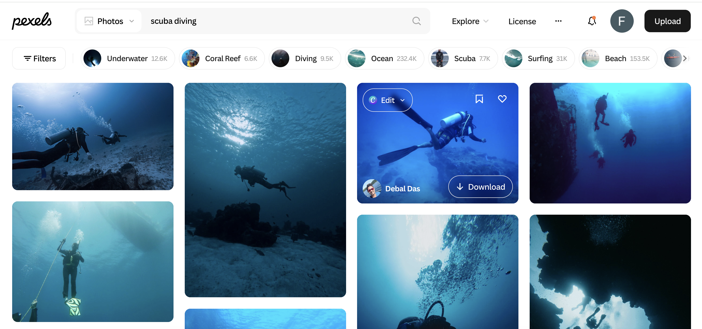
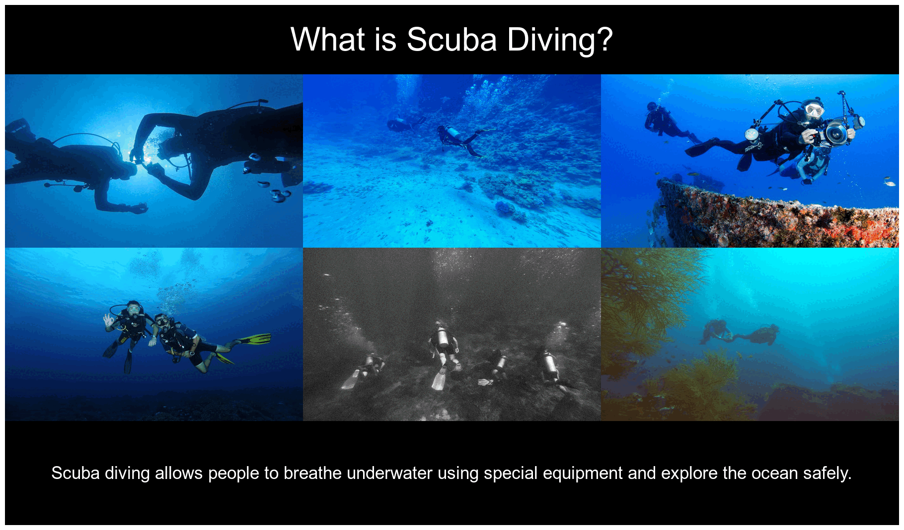

```{r setup}
knitr::opts_chunk$set(echo=TRUE, message=FALSE, warning=FALSE, error=FALSE)

suppressWarnings(
  suppressPackageStartupMessages(
    library(tidyverse)
  )
)
```
```{r, message=FALSE}
selected_photos <- read_csv("selected_photos.csv")
```

```{css echo=FALSE}
body {
  font-family: Arial, sans-serif;
  line-height: 1.6;
}

h2 {
  color: #0B3954;
  border-bottom: 2px solid #0B3954;
  padding-bottom: 6px;
}

img {
  max-width: 100%;
  border-radius: 10px;
}

table {
  width: 100%;
}

blockquote {
  background-color: #BFD7EA;
  padding: 12px;
  border-left: 5px solid #0B3954;
}
```

## Introduction

The two words I used to search for photos were "scuba diving". I choose these words because I am interested in underwater activities and ocean environments.

The URL for my search is:
[https://www.pexels.com/search/scuba%20diving/](https://www.pexels.com/search/scuba%20diving/)



Before exploring the data in R, I observed several features from the Pexels search results for "scuba diving".
First, most of the photos are in landscape orientation, showing wide underwater scenes with divers and ocean environments.
Second, the dominant colours in the images are shades of blue, green and black, as most photos are taken underwater. Some images also include brighter colours from marine organisms or diving equipment.
Third, after clicking on some photos, I noticed that most photos had around 10 likes, while only a small number of photos had more than 30 likes. This suggests that the popularity of the photos was not the same across the search results.


```{r}
selected_photos %>%
  select(URL = url) %>%
  knitr::kable()
```

## Key features of my selected photos

```{r}
mean_width <- mean(selected_photos$width, na.rm = TRUE)
count_landscape <- sum(selected_photos$orientation == "landscape")
mean_ratio <- mean(selected_photos$aspect_ratio, na.rm = TRUE)

grouped <- selected_photos %>%
  group_by(size_group) %>%
  summarise(mean_width = mean(width, na.rm = TRUE))
```

The average width of the selected photos is `r round(mean_width, 0)` pixels.

There are `r count_landscape` landscape photos in the dataset.

The average aspect ratio of the photos is `r round(mean_ratio, 2)`.

Photos in one size group have an average width of `r round(grouped$mean_width[1], 0)` pixels.

## Creativity



For the creativity part, I created an animated GIF where both the images and the text change across frames. Each frame includes a different group of scuba diving photos, along with informative text about scuba diving.

The titles and captions introduce what scuba diving is, what people experience underwater, and what they can discover, such as marine life. This demonstrates creativity because I combined data, visual design and informative content to create a more engaging output.

## Learning reflection

One important thing I learned from this project is how to collect and use data with APIs. Before this, I thought data had to be collected manually, but now I understand that APIs can provide real-world data directly into R, which is much more efficient.

I also learned how to create new variables using mutate() and how to summarise data with group_by() and summarise(). These functions helped me see patterns in the data more clearly and made the analysis easier to understand.

In addition, I learned how to present data in a more interesting way. For example, I used images and created an animated GIF to show the results. This made the report more engaging instead of just showing numbers. In the future, I would like to learn more about how APIs and data technologies can be used in real-life situations.

## Appendix

```{r file='exploration.R', eval=FALSE, echo=TRUE}
```


