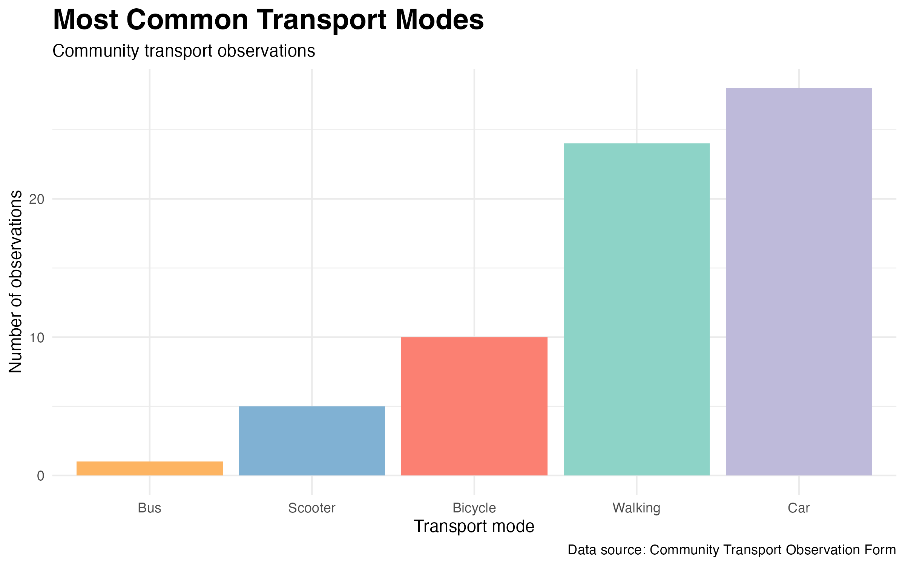
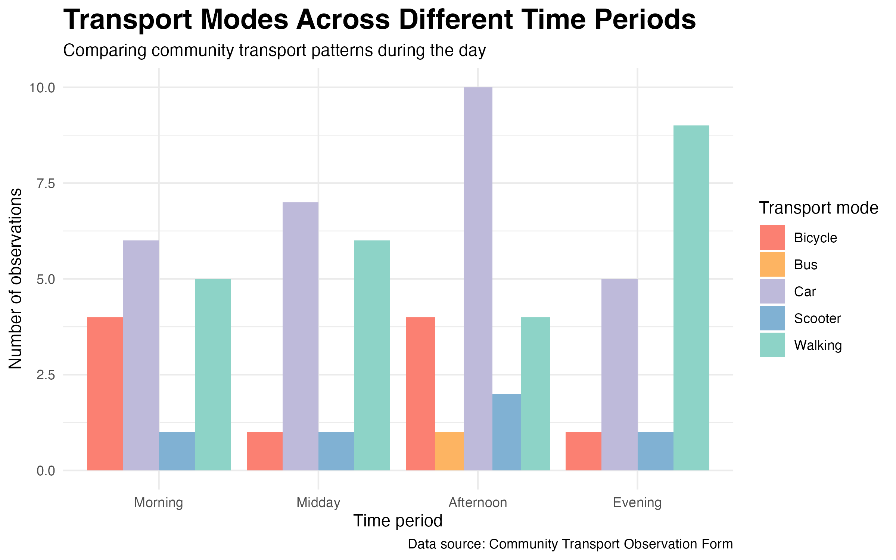
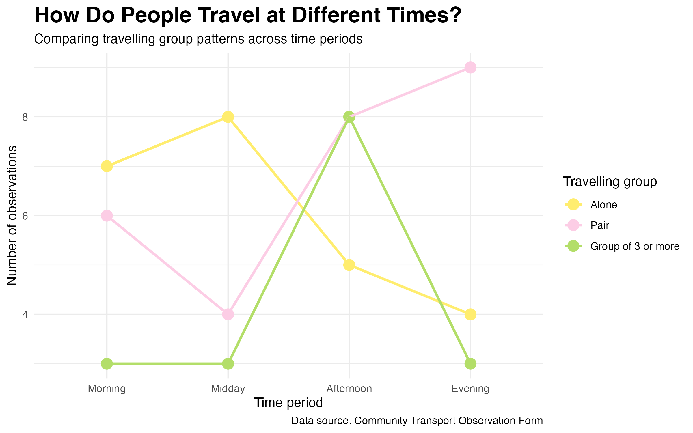
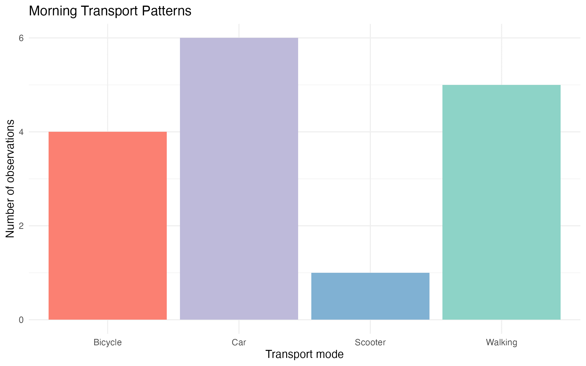

<script src="https://code.jquery.com/jquery-3.7.1.min.js" integrity="sha256-/JqT3SQfawRcv/BIHPThkBvs0OEvtFFmqPF/lYI/Cxo=" crossorigin="anonymous"></script>

```{r setup, include=FALSE}
knitr::opts_chunk$set(echo=FALSE, message=FALSE, warning=FALSE, error=FALSE)
```

```{js}
$(function() {
  $(".level2").css('visibility', 'hidden');
  $(".level2").first().css('visibility', 'visible');
  $(".container-fluid").height($(".container-fluid").height() + 300);
  $(window).on('scroll', function() {
    $('h2').each(function() {
      var h2Top = $(this).offset().top - $(window).scrollTop();
      var windowHeight = $(window).height();
      if (h2Top >= 0 && h2Top <= windowHeight / 2) {
        $(this).parent('div').css('visibility', 'visible');
      } else if (h2Top > windowHeight / 2) {
        $(this).parent('div').css('visibility', 'hidden');
      }
    });
  });
})
```

```{css, echo=FALSE}
.figcaption {display: none}

body {
  background-color: #f2f2f2;
  color: #2d2d2d;
  font-family: Arial, sans-serif;
  line-height: 1.7;
  max-width: 950px;
  margin: auto;
  padding: 30px;
}

h1 {
  color: #80b1d3;
  font-weight: bold;
  font-size: 42px;
}

h2 {
  color: #bc80bd;
  border-bottom: 3px solid #bebada;
  padding-bottom: 8px;
  margin-top: 50px;
}

p {
  font-size: 17px;
}

img {
  display: block;
  margin-left: auto;
  margin-right: auto;
  max-width: 92%;
  border-radius: 16px;
  margin-top: 20px;
  margin-bottom: 20px;
}

blockquote {
  background-color: #ccebc5;
  border-left: 6px solid #8dd3c7;
  padding: 15px;
  font-size: 18px;
}
```

## A small story about everyday movement

Every day, people move through my community in different ways. Some people walk, some drive, some cycle, and others use smaller transport modes such as scooters.

For this visual data story, I used observational data collected through a Google Form. Instead of asking people for opinions, I recorded what I saw in the community at different times of the day.

> This story looks at how transport patterns change from morning to evening.

## Understanding community movement



The first plot gives an overview of the transport modes I observed. It shows that some transport modes appeared much more often than others.

Cars and walking were the most common forms of movement in my observations. This suggests that everyday transport in this community is mainly based on private vehicles and short local trips.

This is the starting point of the story: before looking at time patterns, I first needed to understand what types of transport were most visible overall.

> “Looks like Auckland residents still love their cars.” 🚗

## Transport patterns throughout the day



The second plot adds time into the story. Instead of only asking which transport mode was most common overall, this plot compares transport modes across morning, midday, afternoon, and evening.

This makes the story more interesting because transport behaviour is not the same throughout the day. Morning movement may reflect people travelling to work, university, or school, while afternoon and evening observations may show more local or social movement.

By comparing transport modes across time periods, the data starts to feel less like a simple count and more like a small picture of daily routines.

> “The community seemed busiest with cars during the day, but the evening felt calmer as more people appeared on foot.” 🌆

## Social movement and travelling groups



Transport is not only about how people move. It is also about whether people move alone or with others.

This plot compares people travelling alone, in pairs, and in groups of three or more. It adds a social layer to the story because it shows how movement changes depending on group size.

While collecting the data, I started to notice that the street felt different at different times. Sometimes people were moving quickly by themselves, while at other times people appeared in pairs or small groups.

> "Movement patterns were not only about transport, but also about how people interacted with others throughout the day." 👥

## Visualising change over time



I created this GIF animation to bring the time-based story together. The animation moves from morning to midday, afternoon, and evening, showing how transport patterns shift across the day.

It makes the visual story more engaging. Instead of only showing static charts, the GIF gives the reader a feeling of movement and change.

It also fits the topic of transport because the animation itself creates a sense of motion.

## What these observations reveal

Overall, this visual data story shows that community transport behaviour is shaped by both transport mode and time of day.

Cars and walking were important parts of t
he overall pattern, but the grouped chart and animation show that transport behaviour changes across the day. The travelling group plot also shows that movement is not only individual, because people also travel in pairs and groups.

Although this is a small observational dataset, it reveals something meaningful about everyday life: the community is always moving, but not always in the same way.

> As the day changed, so did the way people moved through the community. 🚶