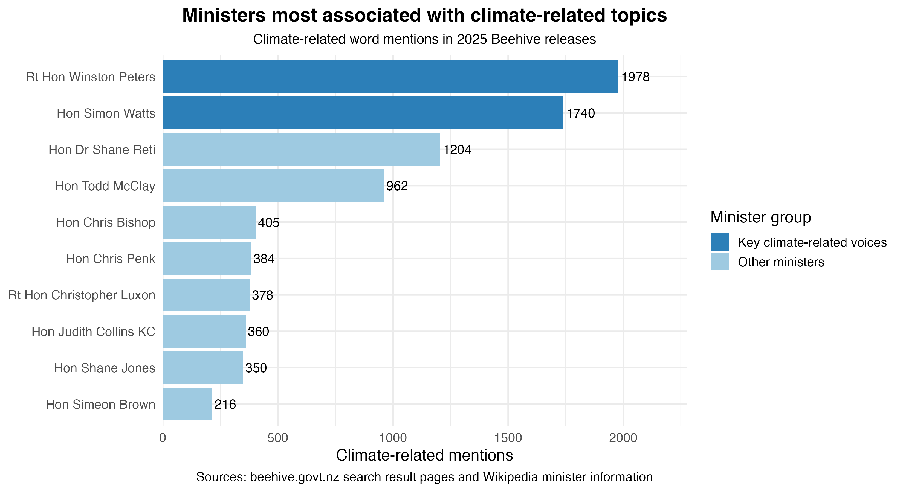

```{css, echo=FALSE}
body {
  font-family: Arial, sans-serif;
  background-color: #f7f9fb;
  color: #263238;
  line-height: 1.6;
}

h1 {
  color: #1b4965;
  border-bottom: 3px solid #2c7fb8;
  padding-bottom: 12px;
}

h2 {
  color: #2c7fb8;
  border-bottom: 2px solid #9ecae1;
  padding-bottom: 6px;
  margin-top: 35px;
}

img {
  display: block;
  margin: 25px auto;
  max-width: 100%;
  border-radius: 12px;
}

pre {
  background-color: #eef5f4;
  padding: 10px;
  border-radius: 8px;
}
```

## Introduction

For Project 5, I focused on climate-related media releases published on the Beehive website, which is the official New Zealand Government news and announcement platform. I used the search term “climate” and filtered the results to 2025 releases from the National/ACT/New Zealand First Coalition Government. This gave me 79 results related to climate change, energy, emissions, carbon, environmental policy, and wider government communication about climate-related topics.

I decided to focus on this set of results because climate change is not only an important political issue in New Zealand, but also a widely discussed global issue. It connects to many areas of government, including energy, foreign affairs, agriculture, infrastructure, and economic development. I wanted to explore which ministers appeared most frequently in climate-related releases, because this can show how climate-related issues are communicated and discussed across different government departments.

When using data from beehive.govt.nz, I needed to use the information responsibly and clearly acknowledge the source. I followed the course instructions by manually saving HTML pages instead of repeatedly sending automated requests to the website. This helped reduce unnecessary pressure on the website and respected the site’s scraping protections. My main data source was the Beehive website: https://www.beehive.govt.nz/. In addition, I used the provided course script to obtain extra minister-related information to support the data combination part of the project..

## Visualisation

The main purpose of my visualisation is to show which ministers were most strongly associated with climate-related topics in the Beehive releases that I collected. I counted climate-related words in the titles and summaries of each release, including words such as climate, carbon, energy, emissions, environment, and environmental. The chart ranks ministers from the highest to the lowest number of climate-related mentions, making it easier to compare which ministers appeared most frequently in government communication about climate-related issues.



## Creativity

My visualisation demonstrates creativity because it combines government release data from Beehive with additional minister-related information to create a more meaningful data story. Instead of only counting the number of releases, I used text analysis to explore climate-related language and connected it to specific ministers. I also used colour to highlight key climate-related voices and added visual annotations to guide the reader’s attention. This makes it easier for readers to quickly understand the main patterns and relationships shown in the data.

## Learning reflection

One important idea I learned from Module 5 is that digital data does not always come in a clean spreadsheet. Sometimes data needs to be created from digital sources such as HTML pages or APIs. In this project, I used saved Beehive HTML pages and applied web scraping methods to extract titles, dates, ministers, portfolios, and summaries. This helped me understand how HTML structure and CSS selectors can be used to turn webpage content into a tidy data frame.

I also learned that responsible data collection is important. Before scraping data, we need to check the website rules, avoid over-requesting, and think carefully about how the data will be used. I am more curious about how APIs can be used to collect structured data more efficiently.

## Self review

Across the five STATS 220 projects, I believe I have developed two important skills. The first skill is communicating with data and technology. I have learned how to create visual reports that explain not only what the data shows, but also why the results matter. This connects to the course learning outcome of developing communication with data and technology, because I now understand that a good data project needs both technical work and clear report.

The second skill is using R to work with data from different sources. Through the projects, I practised using packages such as tidyverse, ggplot2, rvest, jsonlite, and stringr. I became more confident with reading data, cleaning data, combining tables, analysing text, and creating visualisations. Project 5 especially helped me understand how web scraping and APIs can be used to create data from digital sources. These skills are useful because they allow me to turn real-world digital information into a clear and meaningful data story.

## Appendix

```{r file='scrape_html.R', eval=FALSE, echo=TRUE}

```

```{r file='data_sources.R', eval=FALSE, echo=TRUE}

```

```{r file='visualisation.R', eval=FALSE, echo=TRUE}

```